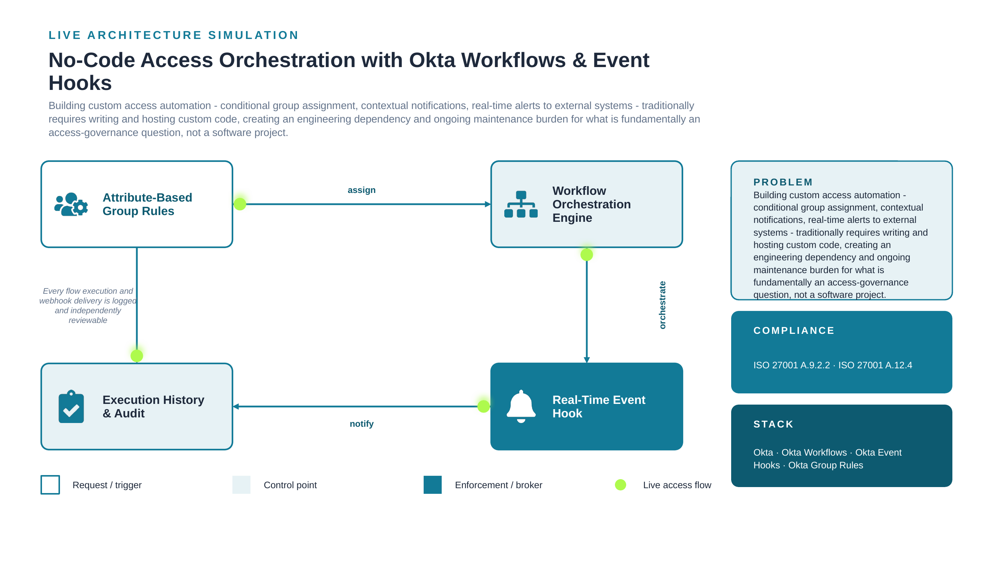

# 16. No-Code Access Orchestration with Okta Workflows & Event Hooks

**Classification:** Internal Use - Portfolio Demonstration
**Control Owner:** Identity & Access Management (IAM) Engineering
**Document Status:** Approved
**Last Reviewed:** 2026-08-24
**Review Cadence:** Annual, or upon material architecture change

---

## 1. Executive Summary

Building custom access automation - conditional group assignment, contextual notifications, real-time alerts to external systems - traditionally requires writing and hosting custom code, creating an engineering dependency and ongoing maintenance burden for what is fundamentally an access-governance question, not a software project. This document set describes the control designed and implemented to remediate that exposure, the residual risk accepted following implementation, and the evidence required to demonstrate the control is operating effectively.

## 2. Scope

This control applies to the identity and access systems described in Section 4 (Architecture) and the compliance requirements listed in Section 5. It does not extend to systems outside the stack listed below without a documented scope-extension review.

**In-scope systems:** Okta, Okta Workflows, Okta Event Hooks, Okta Group Rules

## 3. Risk Statement

**Inherent risk (pre-control):** Access-governance automation requiring custom code creates both a delivery bottleneck (dependent on engineering capacity) and an ongoing maintenance liability, increasing the likelihood that useful automation simply doesn't get built, leaving processes manual and error-prone by default.

**Residual risk (post-control):** Low. Group assignment, conditional routing, and real-time external notification are all implemented natively, with Okta-managed execution history providing the audit trail. Residual risk relates to Event Hook endpoint availability on the receiving system's side, which is outside Okta's control and should be monitored independently by the receiving system's owner.

## 4. Architecture



Full architecture rationale, alternatives considered, and consequences are documented in [`architecture/decision-record.md`](architecture/decision-record.md).

*Diagram legend: white/outlined nodes are the request trigger, tinted nodes are control points, solid-filled nodes are the enforcement/broker layer. The dashed loop shows the audit/feedback path back to the system of record.*

## 5. Compliance Mapping

| Requirement | Description |
|---|---|
| ISO 27001 A.9.2.2 | User access provisioning |
| ISO 27001 A.12.4 | Logging and monitoring |

Full control testing procedure and evidence requirements are documented in [`compliance/compliance-mapping.md`](compliance/compliance-mapping.md).

## 6. Governing Policy

Formal, auditable policy statements for this control are documented in [`policies/access-control-policy.md`](policies/access-control-policy.md). All numbered statements use normative "shall" language consistent with ISO 27001 Annex A documentation conventions.

## 7. Evidence & Screenshots

This repository does not ship placeholder screenshots. [`screenshots/SCREENSHOTS_NEEDED.md`](screenshots/SCREENSHOTS_NEEDED.md) defines the exact evidence an auditor or control tester would expect to see, mapped to each implementation step.

## 8. Directory Structure

```
16-okta-workflows-no-code-orchestration/
├── README.md                      <- this document
├── architecture/
│   ├── architecture.png
│   └── decision-record.md         <- ADR: context, decision, alternatives, consequences
├── compliance/
│   └── compliance-mapping.md      <- control objective, testing procedure, evidence, residual risk
├── policies/
│   └── access-control-policy.md   <- formal policy statements, roles, exceptions, enforcement
├── screenshots/
│   └── SCREENSHOTS_NEEDED.md      <- evidence capture checklist
└── .gitattributes
```

## 9. Lessons Learned

The Event Hook's verification handshake - Okta sending a one-time challenge the receiving endpoint must echo back before the hook activates - is a small but deliberate anti-spoofing design detail that's easy to miss reading documentation and obvious the moment you actually have to complete it by hand.

---

[⬅ Back to portfolio index](../README.md)
